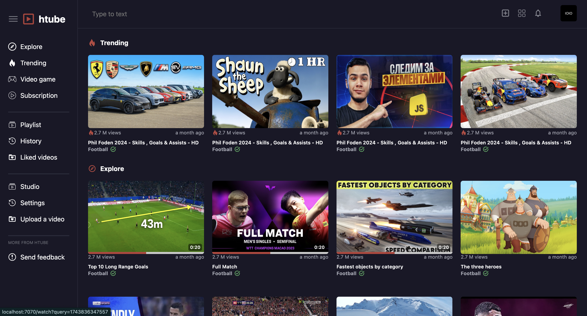
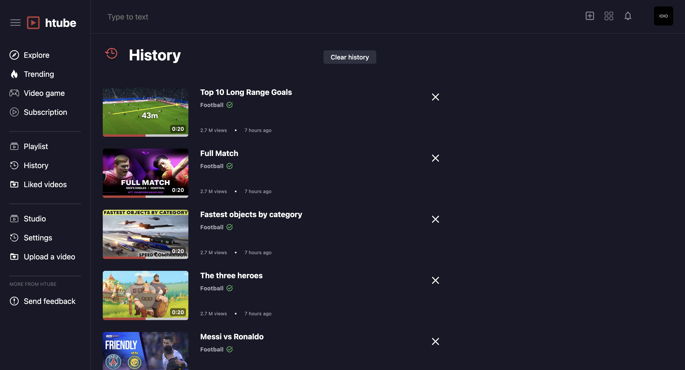
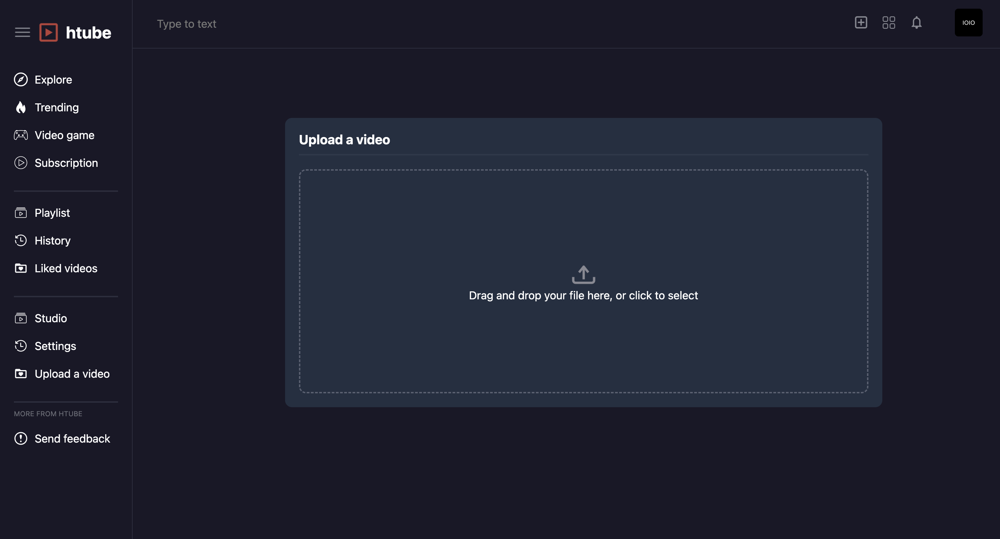
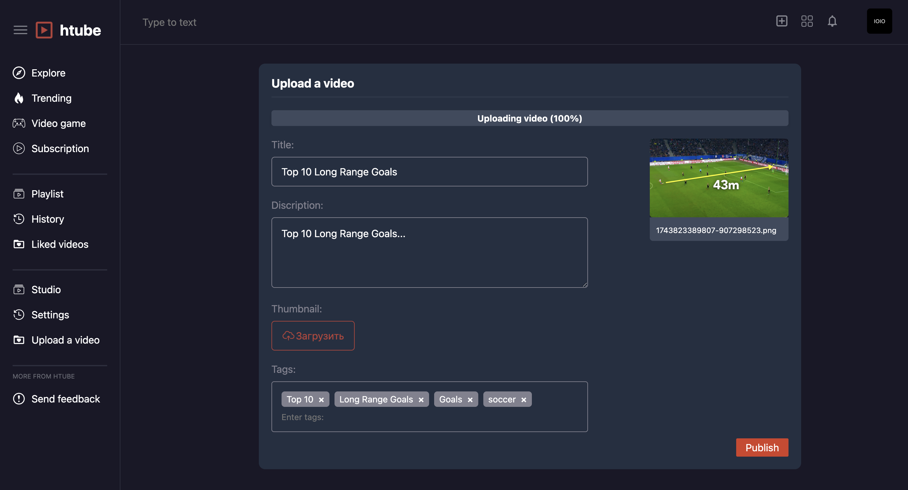
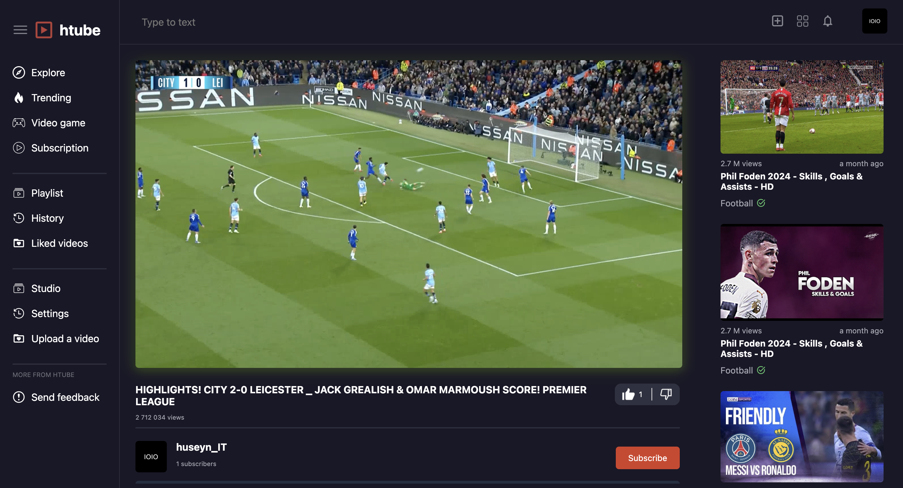

# 🎬 htube(YouTube Clone)
>Youtube clone | Full Stack project

**Полнофункциональный клон YouTube с системой видео, комментариев и подписок**



## ✨ Основные возможности

### 🎥 Видео хостинг
- Адаптивный стриминг (HLS) с поддержкой 480p/720p/1080p
- Прогресс просмотра для каждого видео
- Система лайков/дизлайков

### 💬 Социальные функции
- Комментарии с ответами и вложенностью
- Лайки/дизлайки для комментариев
- Подписки на каналы
- История просмотров

### 👤 Персонализация
- Гостевой режим
- Регистрация с подтверждением email
- Настройки профиля

## 🛠 Технологии

**Серверная часть:**
<div align="left">
  
  
  
  
</div>

**Клиентская часть:**
<div align="left">
  
  
  
</div>

## 🚀 Быстрый старт

1. Клонируйте репозиторий:
```bash
git clone https://github.com/SharipovHuseyn/youtube-clone.git
cd htube/server/

2. Install dependencies:
```bash
npm install
```

3. Set up environment:
  ./server/.env
```bash
SECRET_KEY_REGISTER = YOUR_REGISTER_KEY_RECAPTCHA
SECRET_KEY_LOGIN = YOUR_LOGIN_KEY_RECAPTCHA
PASSWORDGMAIL = YOUR_PASSWORD_GMAIL

DB_HOST = localhost
DB_USER = root
DB_PASSWORD = root
DB_DATABASE = htube
DB_PORT = 8889
```

4. Database setup:
- Create MySQL database
- Import structure from `htube.sql`

5. Run the server:
```bash
node server.js
```

Visit `http://localhost:7070` in your browser.

## Project Structure

```
├── client/               # Frontend assets
│   ├── src/              # Static files
│   └── pages/            # EJS templates
├── uploads/              # User uploads
│   ├── avatars/          # Profile pictures
│   ├── banners/          # Video thumbnails
│   └── videos/           # Processed video files
├── server.js             # Main application
├── htube.sql          # Database schema
└── .env.example          # Configuration template
```

## API Endpoints

| Endpoint | Method | Description |
|----------|--------|-------------|
| `/uploadVideo` | POST | Upload and process video |
| `/watch` | GET | Stream video content |
| `/comments` | POST | Add new comment |
| `/subscribe` | POST | Subscribe to channel |
| `/history` | GET | Get watch history |

## Screenshots





